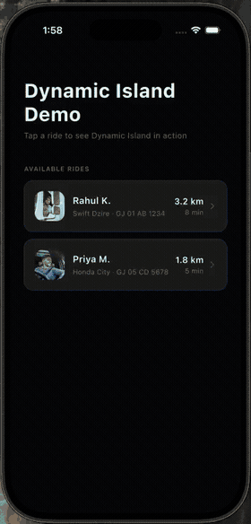

# Dynamic Island Demo

Ride tracking in a real iOS **Live Activity** — driven from Flutter over a
MethodChannel, with the driver photo passed to the widget through an App Group.

//Update with the original draft post
📖 Full write-up: [Dynamic Island + Flutter](https://medium.com/@ami.b_7192/9cfbc782e740)

<p align="center">
  
</p>

## Requirements

- Flutter 3.38+ · Xcode 16+ · **iOS 16.2+** (both targets)
- **iPhone 14 Pro or later** for the Island. The Lock Screen banner works on any
  iOS 16.2+ device — but the Simulator never renders the Island itself.
- **Paid** Apple Developer account. App Groups can't be registered on a free
  Personal Team, and without one the driver photo never reaches the widget.

## Run it

```bash
git clone https://github.com/ami-b-simform/dynamic_island_blog_demo.git
cd dynamic_island_blog_demo
flutter pub get
open ios/Runner.xcworkspace
```

In Xcode → Signing & Capabilities, set **the same team** on both `Runner` and
`RideTrackerWidgetExtension` (no team is committed). If `com.example.*` is taken
under your account, rename both bundle IDs — the widget's must stay nested under
the app's — and update the App Group to match.

The ride advances every 3s through `preparing → pickedup → arriving → delivered`,
then dismisses 5s after delivery.

## The App Group ID

One identifier, three places — change it everywhere or nowhere. A mismatch is
silent: the activity still runs, the photo just never appears.

```
group.com.example.dynamicIslandFlutter
```

| Where | |
|---|---|
| `Runner` | Signing & Capabilities → App Groups |
| `RideTrackerWidgetExtension` | Signing & Capabilities → App Groups |
| [`ios/Shared/ImageHelper.swift`](ios/Shared/ImageHelper.swift) | `appGroupID` |

## Layout

```
lib/
  home_screen.dart                    pick a ride
  tracking_screen.dart                drives the stage updates
  models/driver.dart
  channel/live_activity_channel.dart  Dart → Swift MethodChannel
ios/
  Shared/                             ← compiled into BOTH targets
    RideAttributes.swift              the app/widget data contract
    ImageHelper.swift                 App Group read + write
  Runner/AppDelegate.swift            start / update / end the activity
  Runner/RideTrackerWidget/           the Live Activity UI
```

`ios/Shared/` is an Xcode *synchronized folder* on both targets, so
`RideAttributes` — the contract the two sides agree on — exists exactly once.
Add a field and both sides see it next build; they can't drift apart.

**Flow:** save the photo to the App Group → `startActivity` → `updateActivity`
on each tick → `endActivity` shows the closing line, then dismisses.

